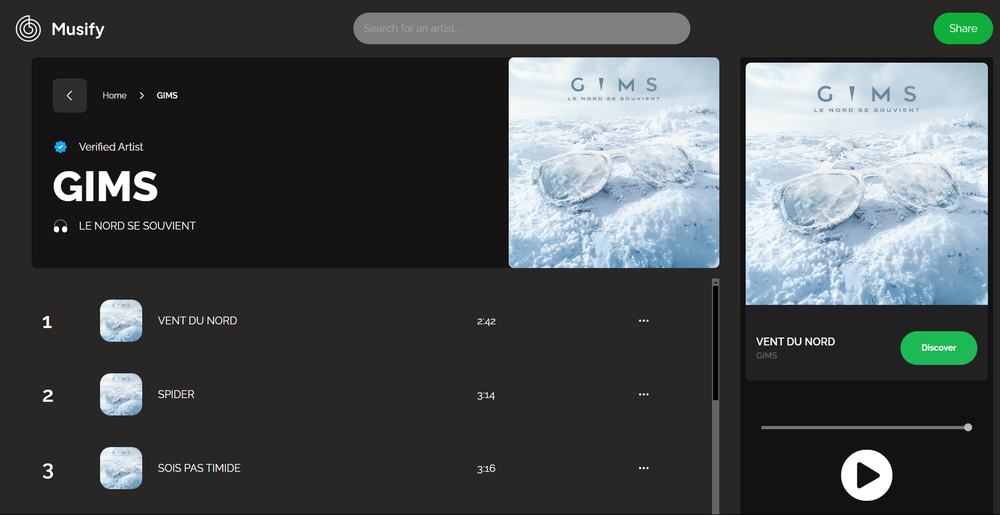

# musify



A musical project done with the Spotify Web API to play music from artists, get their albums and
have great musical recommandations.

## Table of Contents
- [Technologies](#technologies)
- [Installation](#installation)
- [Features](#features)
- [Inspiration](#inspiration)


## Technologies
Project created with :


## Installation
```bash
 git clone https://github.com/Valeryio/musify.git
```

2. Install dependencies:
```bash
    apt get install python3
 ```

3. Activate the python environment
```bash
    cd env/script
    ./activate
```

4. Run the python project
```python
    python run.py
```


## Features
- Get recommendation of albums to listen
- Get all the albums from an artist
- Get the most popular albums, and tracks from a specific artist
- Get all the song of the artist
- Play a song, from an album
- Search for specific artist and its attributes


## Inspiration
This project is inpired from [Spotify](https://open.spotify.com/intl-fr)